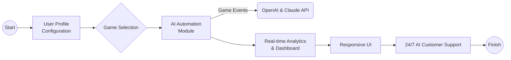

# ⛩️ Pet Companion Portal: AI-Powered Multi-Game Pet Automation

---

Welcome to **Pet Companion Portal**—the next evolution in pet-game automation, elevating player experiences to an art form. Inspired by cutting-edge tools like "Pet-Simulator-99 Script," this project takes things further: fusing smart algorithms, OpenAI assistance, and customizable workflows into a cross-title pet automation suite for Roblox and beyond.

Unleash the power of AI and automation to transform *how* you play pet simulation titles, quest, and collect. Our software introduces proactive strategies, intuitive profiles, and voice-driven controls to help you tame the game—without losing your sense of play!

---

## 🚀 Table of Contents

- About the Project
- Features List 🌟
- Why Choose Pet Companion Portal? 🤔
- SEO-Friendly Highlights
- Mermaid Diagram: Workflow Overview
- Supported Platforms & System Requirements
- OS Compatibility Table ⚡
- Example Profile Configuration
- Example Console Invocation
- OpenAI & Claude API Integration 🤖
- Responsive UI & Multilingual Support 🌐
- 24/7 Customer Assistance 💬
- Disclaimer & Ethical Use
- License & Credits
- Download & Quick Start

---

## 🐾 About the Project

Pet Companion Portal is a robust, cross-platform automation toolkit for pet simulation games. It harnesses AI-powered scripting, cloud profiles, and seamless UI to offer strategic automation for farming, quests, trading, and collection.

Born from the spirit of community collaboration and the desire to elevate gameplay, Pet Companion Portal aims to become the premier hub for pet game mastery—on Roblox and other platforms where virtual pets reign.

---

## 🌟 Features List

- **AI-Driven Automation**: Set and forget! Smart routines adapt to in-game events and user preferences powered by OpenAI and Claude APIs.
- **Universal Game Integration**: Expandable modules for games like Pet Simulator X, Adopt Me!, Clicker Pets, and more.
- **Seamless Cloud Profiles**: Save, share, and load custom gameplay profiles across devices & friends.
- **Dynamic Quest Assistance**: Automatic quest completion with intelligent pathing and decision trees.
- **Egg Opening Automation**: Target rare pets, batch open, and manage inventory on autopilot.
- **Coin & Loot Collection**: Optimizes routes for efficiency. Collects in-game currencies automatically.
- **Trade Sniper Module**: Monitors in-game booths and markets for the best pet trades with live AI price suggestions.
- **Ranking Automation**: Automatically climbs leaderboard rankings using safe and anti-idle methods.
- **Real-Time Analytics**: See profit, rarity, team strength, and collection statistics in vivid dashboards.
- **Responsive Multiplatform UI**: Supports desktops, tablets, and mobile; deploy via native or browser.
- **Multilingual Support**: English, Español, Português, 中文 (简体/繁體), Русский, Deutsch, Français, and more!
- **Voice Control**: Issue commands or check status using integrated voice recognition.
- **Extensible Plugin System**: Build and share game-specific automation plugins.
- **24/7 Customer Assistance**: Integrated in-app support chat with AI troubleshooting.
- **Secure Profile Encryption**: All sensitive data encrypted with AES-256.
- **Ethical Safeguards**: Play within platform Terms of Use. Clear boundaries to respect game integrity.

---

## 🤔 Why Choose Pet Companion Portal?

Pet Companion Portal is not just another automation tool—it's your trusted, AI-augmented companion. By blending game-savvy routines with next-gen AI, this platform is more than a script: it’s a pet game strategist, always evolving and always by your side.

Whether you’re after the rarest egg or negotiating trades, you’ll have not just automation but insight. Support is just one click—or voice command—away.

---

## 🔍 SEO-Friendly Highlights

- **All-in-one pet game toolkit**
- **AI pet automation for Roblox**
- **Roblox pet quest optimizer**
- **Automated egg opening strategies**
- **In-game trading AI assistant**
- **Cross-platform pet simulator helper**
- **Secure, cloud-based pet automation**
- **Real-time analytics for pet sim games**
- **Roblox game ranking automation**
- **Voice-controlled pet bot**
  
*Upgrade your pet simulation experience with the most advanced, secure, and user-friendly automation suite on the market in 2026!*

---

## 🗺️ Mermaid Diagram: Workflow Overview

---

## 💻 Supported Platforms & System Requirements

**Platforms:**
- Windows 10/11
- macOS (Monterey or later)
- Linux (Ubuntu 20.04+)
- Browser-based (Chrome, Firefox, Edge, Safari)
- iOS & Android (Companion app for profile sync only)

**Requirements:**
- Node.js 18+
- 4GB RAM minimum
- At least 1GB free disk space
- OpenAI/Claude API token (for advanced features)
- Internet connection for cloud sync & analytics

---

## ⚡ OS Compatibility Table

| OS         | GUI Support | CLI Support | Voice Control | Multilingual | Tested (2026) |
|------------|:-----------:|:-----------:|:-------------:|:------------:|:-------------:|
| 🪟 Windows |      ✅     |     ✅      |      ✅       |      ✅      |      ✅       |
| 🍏 macOS   |      ✅     |     ✅      |      ✅       |      ✅      |      ✅       |
| 🐧 Linux   |      ✅     |     ✅      |      ✅       |      ✅      |      ✅       |
| 🌐 Browser |      ✅     |     ❌      |      ✅       |      ✅      |      ✅       |
| 📱 Mobile* |      ✅     |     ❌      |      ✅       |      ✅      |      ⚠️       |

\*Mobile app for profile sync and analytics. Direct automation on mobile is not supported.

---

## 🔑 Example Profile Configuration

Here is an excerpt from a user profile JSON for a typical "Pet Simulator X" power user:

{
  "profileName": "GemGrinder2026",
  "targetGame": "Pet Simulator X",
  "autoFarm": true,
  "eggAutomation": {
    "enabled": true,
    "targetRarity": "Legendary",
    "batchOpen": 10
  },
  "questAssist": {
    "autoComplete": true,
    "prioritize": ["Chest Break", "Coin Gather"]
  },
  "tradeSniper": {
    "enabled": true,
    "maxPrice": 500000,
    "notifyOnly": false
  },
  "language": "English",
  "useVoiceControl": true,
  "analyticsEnabled": true
}

---

## 🖥️ Example Console Invocation

For scripting power-users and advanced setup:

$ pet-portal --profile ./profiles/GemGrinder2026.json --openai-key <YOUR_KEY> --dashboard --voice

---

## 🤖 OpenAI & Claude API Integration

Pet Companion Portal leverages both the OpenAI and Claude APIs for natural language understanding, predictive automation, trade evaluation, and 24/7 customer support chat. Configure your API keys safely in the "api-keys.json" file for access to all AI-driven modules.

**Benefits:**
- Smart, conversation-based commands.
- Contextual trade suggestions.
- AI-generated quest solutions.
- Rich 24/7 in-app help—instantly.

---

## 🌐 Responsive UI & Multilingual Support

Our beautiful interface is built to scale—enjoy an optimized UX whether you’re on desktop, laptop, tablet, or web. Change your language in one click; your entire experience will update live. Community-driven localization ensures cultural accuracy.

---

## 💬 24/7 Customer Assistance

Never wait for help! The integrated AI chat assistant is your reliable partner—resolving issues, offering tips, and even walking you through training and game modules. Human escalation available for complex tickets.

---

## ⚠️ Disclaimer & Ethical Use

**Pet Companion Portal (2026) respects the integrity of all supported games and their communities.** All automation features are designed within the boundaries of platform Terms of Use. We urge all users to keep fair-play principles in mind and only deploy automation on accounts they own or have explicit permission to manage. Abuse or misuse is against our guiding code of conduct. The creators are not liable for actions taken against accounts due to policy violations.

---

## 📜 License & Credits

This project is licensed under the [MIT License](https://opensource.org/licenses/MIT) — 2026 Pet Companion Portal Contributors.

---

## ⏩ Download & Quick Start

To get started now:
1. Download the installer.
2. Create or import your profile.
3. Connect your OpenAI/Claude API keys.
4. Select your game and let Pet Companion Portal take it from there!

*For full instructions, see the `docs/` folder in the repository.*

---

Welcome to the next stage of pet automation mastery—**Pet Companion Portal** is your bridge to effortless fun and optimized simulation journeys!